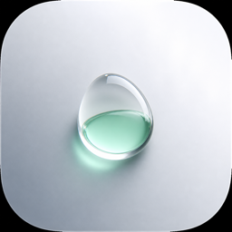
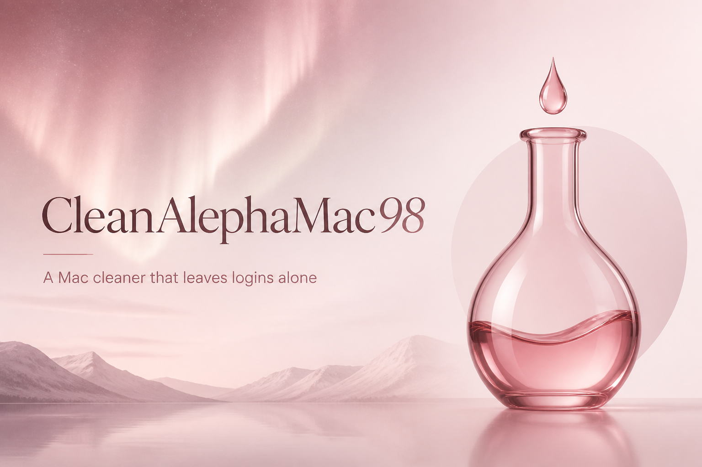
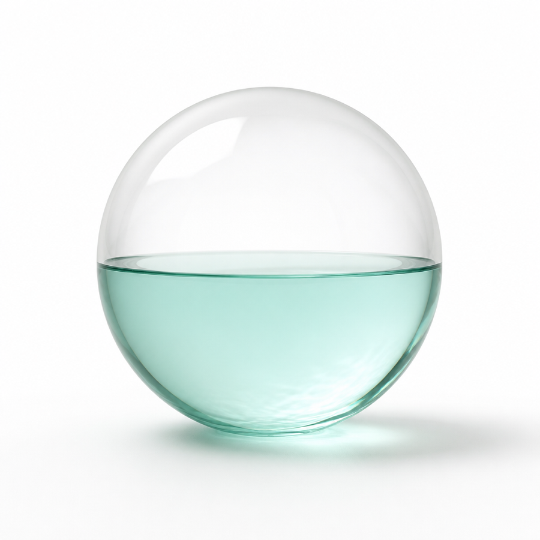

<p align="center">
  
</p>

<h1 align="center">CleanAlephaMac98</h1>

<p align="center">
  <strong>Клинер для macOS, который не ломает входы.</strong><br>
  A Mac cleaner that leaves Safari and Chrome logins alone.
</p>

<p align="center">
  <a href="https://github.com/Alepha98/CleanAlephaMac98/releases/latest/download/CleanAlephaMac98.dmg"></a>
  &nbsp;
  <a href="https://github.com/Alepha98/CleanAlephaMac98/releases/latest"></a>
</p>

<p align="center">
  
  
  
  
  
</p>

<p align="center">
  
</p>

---

## Скачать

Нажми кнопку — качается **установщик `.dmg`**, не исходники.

<p align="center">
  <a href="https://github.com/Alepha98/CleanAlephaMac98/releases/latest/download/CleanAlephaMac98.dmg">
    
  </a>
</p>

1. Открой `CleanAlephaMac98.dmg`
2. Перетащи приложение в **Applications**
3. Первый запуск: **правый клик → Открыть**  
   (подпись Apple Developer пока ad-hoc — Gatekeeper один раз спросит)
4. Если macOS всё равно ругается: `xattr -cr /Applications/CleanAlephaMac98.app`

Для Сообщений и Telegram включи **Полный доступ к диску** в Системных настройках. Кэши Chrome/Safari чистятся и без этого.

---

## Download

Click the button. You get a **`.dmg` installer**, not a zip of source.

1. Open `CleanAlephaMac98.dmg`
2. Drag the app into **Applications**
3. First launch: **right-click → Open** (ad-hoc signed; Gatekeeper asks once)
4. If macOS still blocks it: `xattr -cr /Applications/CleanAlephaMac98.app`

Turn on **Full Disk Access** if you want Messages / Telegram in the scan. Browser caches work without it.

---

## Что умеет

- **Кэши как у больших клинеров** — `~/Library/Caches`, профили Chrome / Safari / Edge / Brave / Firefox / Яндекс. Куки и пароли не трогаем.
- **Свои исключения** — добавь папку. Или с карточки: правый клик → «Не трогать эту папку». Без правки кода.
- **Своё расписание** — свои часы, тумблер «Автоочистка». По расписанию снимаются только кэши, не медиа и не корзина.
- **Telegram сам находится** — любые аккаунты на этом Mac, не хардкод чужого компьютера.
- **Защита из коробки** — Colima, Parallels, Gradle, iOS Simulator, DeviceSupport, Claude VM, Photos. Только если эти папки реально есть.
- **Никакой телеметрии.** Всё локально, на твоём диске.

<p align="center">
  
</p>

---

## Requirements

| | |
| --- | --- |
| macOS | 14 Sonoma or newer |
| Chip | Apple Silicon and Intel (universal) |
| Disk | Full Disk Access is optional, recommended for Messages / Telegram |

---

## Privacy

No accounts. No cloud. No analytics. The auto-clean LaunchAgent lives in your user domain and writes `~/Library/Logs/CleanAlephaMac98.log`. Browser login databases are on a denylist.

---

## Build from source

```bash
git clone https://github.com/Alepha98/CleanAlephaMac98.git
cd CleanAlephaMac98
zsh packaging/install.sh
open ~/Applications/CleanAlephaMac98.app
```

Make a DMG:

```bash
zsh packaging/make-dmg.sh
open dist/CleanAlephaMac98.dmg
```

Needs Xcode Command Line Tools and macOS 14+.

---

## License

[MIT](LICENSE). Free to use, fork, and give to people who will not rebuild the app.
